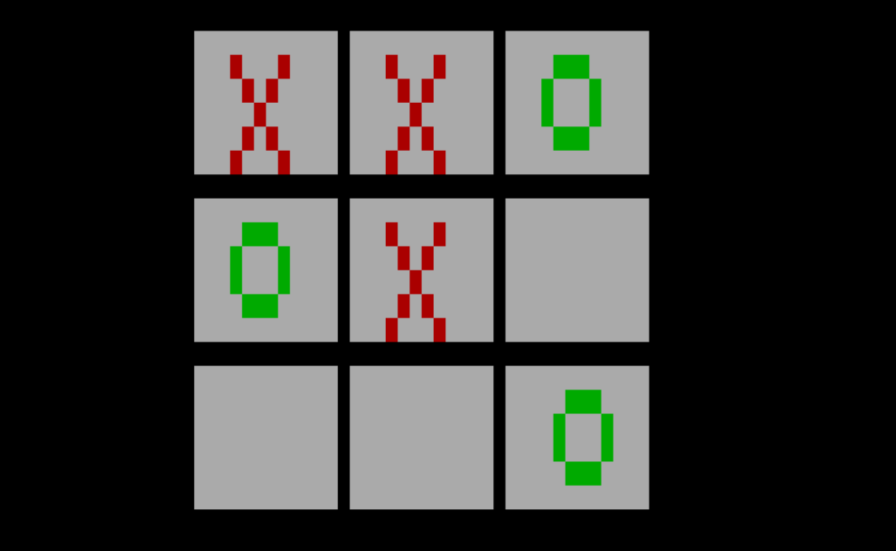

# tictacpoof-x86
A variant of Tic Tac Toe written in x86 assembly. Each player is allowed a maximum of 3 marks on the board. When a fourth move is made, the oldest mark is removed automatically.

players alternate turns to place X and O symbols on a 3×3 grid using number keys 1–9 to select cells:
- Keys 1–3 → top row  
- Keys 4–6 → middle row  
- Keys 7–9 → bottom row

perview:
